[github.com/JustKay1029](https://github.com/JustKay1029) &nbsp;·&nbsp;
[linkedin](https://linkedin.com) &nbsp;·&nbsp;
[email](mailto:your.email@example.com)

> Full-stack developer & software engineer. 
> Crafting clean code, automated workflows, and high-performance tools.

I build fast, test on real users, and optimize continuously. 
Currently focused on developing scalable web systems, automation scripts, and exploring real-time data pipelines.

<samp>python &nbsp; typescript &nbsp; javascript &nbsp; react &nbsp; node &nbsp; next.js &nbsp; postgres &nbsp; docker &nbsp; git &nbsp; github-actions</samp>

**[awesome-project](https://github.com/JustKay1029/awesome-project)** &nbsp;·&nbsp; <samp>typescript, next.js</samp> 
A modern web application built for speed, responsiveness, and clean user experience.

**[automation-scripts](https://github.com/JustKay1029/automation-scripts)** &nbsp;·&nbsp; <samp>python</samp> 
A suite of utilities to automate repetitive developer workflows, data scraping, and local setups.

Every graphic here is generated, not embedded from anyone else's server. 
`ascii.svg` is my photo pushed through a character ramp; the stat graphics and 
these section headings are drawn by [a scheduled action](.github/workflows/stats.yml) 
straight from the GitHub GraphQL API, once a day, committing only what changed.

They animate with SMIL inside the SVG, because GitHub strips scripts from 
READMEs — and since nothing loads from a third party, nothing here can 
rate-limit or go dark. The headings are SVGs for the same reason: GitHub also 
strips CSS, so an image is the only way to put this page's own typeface on them.

The typeface is [JetBrains Mono](scripts/fonts), subset to just the characters 
each graphic draws and inlined as base64. That isn't only for looks: the 
portrait's grid assumes an advance width of exactly 0.600 em, and a viewer whose 
default monospace is narrower would otherwise see it squeezed.

Language totals cover public repositories only. `year.svg` uses the portrait's 
character ramp: `:` `+` `#` `@`, quiet to loud.
